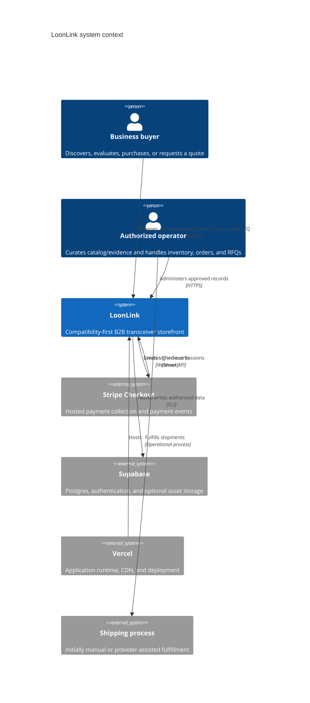
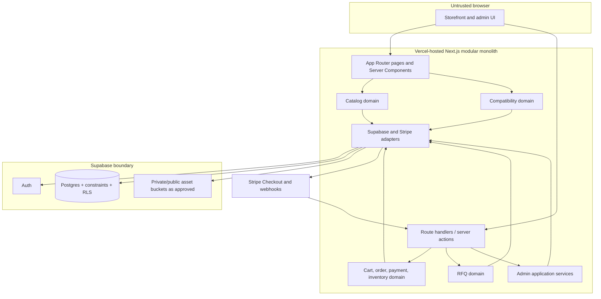
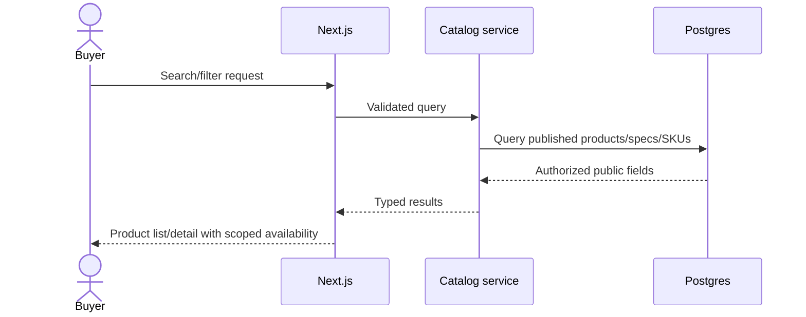
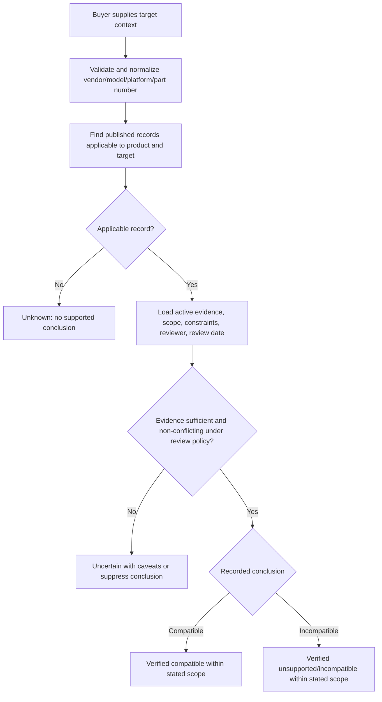
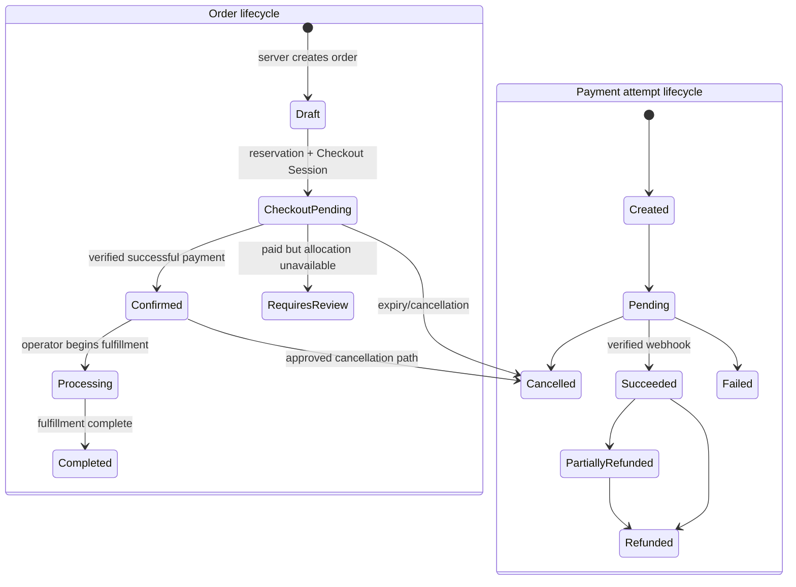
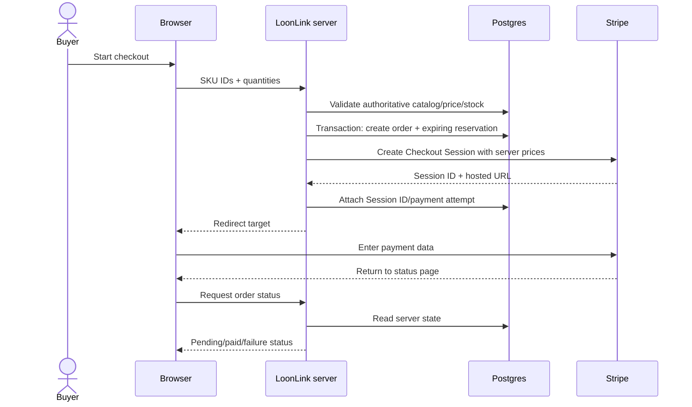
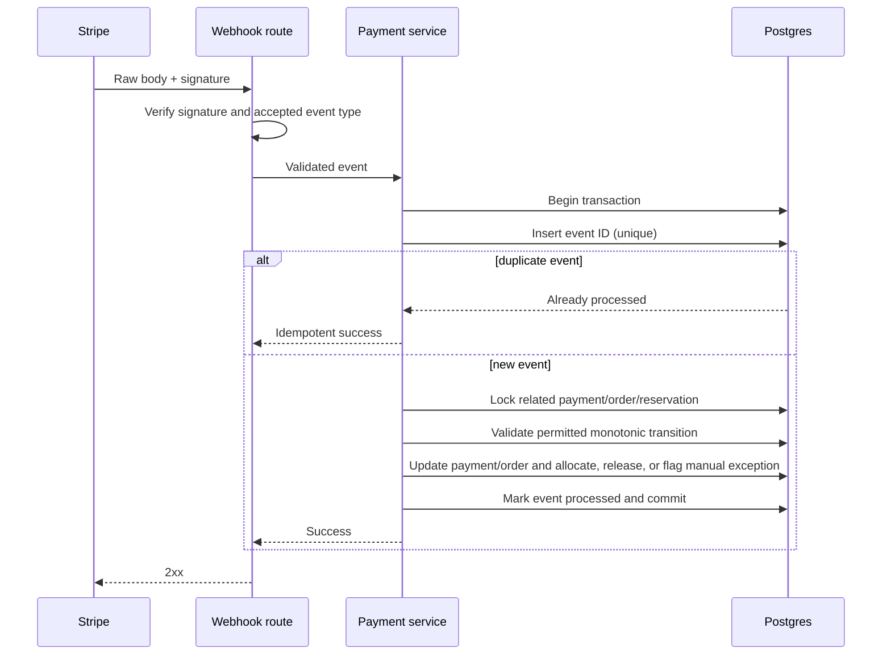
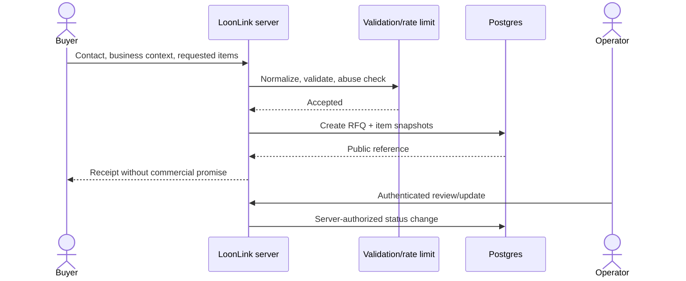
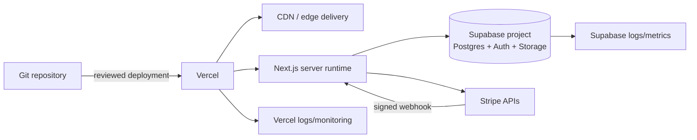

# LoonLink Architecture

## Architecture goals

LoonLink will begin as a cost-conscious modular monolith optimized for a solo developer. The design favors managed services, one deployable application, one relational database, explicit trust boundaries, and database-enforced invariants. Development fixed infrastructure targets CAD $0/month. Early production targets Vercel Pro with Supabase Free where appropriate; Supabase should be upgraded only after usage, capacity, backup, support, or reliability evidence justifies it.

This is a target architecture, not a statement that any service is currently configured.

## System context

## Major components

Domain modules own validation and business rules. Page components and route handlers translate protocols; they do not own authoritative pricing, compatibility, authorization, or inventory logic. Server-only adapters isolate credentials and provider APIs.

## Inventory authority

Each physical unit exists in exactly one authoritative representation:

- **Aggregate/cohort bucket:** `quantity_on_hand` is the physical-stock authority for interchangeable units. The bucket has no serialized-unit rows.
- **Serialized bucket:** qualifying `inventory_units` rows are the physical-stock authority. The bucket has no aggregate quantity.

A bucket is homogeneous for SKU, location, tracking mode, sellable condition basis, and testing/provenance basis. Commercial holds use one `inventory_commitments` relationship with reserved/allocated/released/consumed states; inventory units do not duplicate reservation or order ownership. Available aggregate stock is physical quantity minus active commitments. Available serialized stock is on-hand units without an active commitment.

Mode conversion is an explicit, authorized transaction with no active commitments. The same physical unit must never be represented simultaneously by aggregate quantity and a serialized row.

## Trust boundaries

| Boundary | Trusted for | Never trusted for |
| --- | --- | --- |
| Browser ↔ Next.js | Auth session token transport after validation | Prices, totals, discounts, roles, ownership, stock, compatibility, payment success |
| Next.js ↔ Supabase | Authenticated database/storage transport | RLS bypass as a substitute for application authorization |
| Next.js ↔ Stripe API | Stripe API response after authenticated transport | Client-supplied line-item amounts or a redirect as proof of payment |
| Stripe ↔ webhook endpoint | Event only after raw-body signature verification | Unsigned payloads, duplicate delivery, event order, metadata as sole authorization |
| Public ↔ admin domain | Public published/read model only | Hidden UI as access control or user-supplied admin role |
| Operator ↔ evidence records | Curated input after server authorization | Claims without provenance, review, scope, or supported status transition |
| Application ↔ logs/storage | Minimum operational data | Secrets, raw card data, unnecessary personal data, unrestricted evidence uploads |

## Storefront flow

Search uses normalized typed columns and indexed identifiers/specifications. Public reads return only published catalog records and customer-safe inventory presentation. Exact quantity visibility remains a product decision.

All public catalog APIs and render paths use an explicit allowlisted public DTO. Product pages, compatibility pages, SEO metadata, JSON-LD, sitemaps, feeds, and previews must use that projection or an equally strict allowlist. Serial numbers, cost/supplier data, private stock information, internal notes, customer data, Stripe identifiers, and restricted evidence/testing details never enter it. UI hiding and robots directives are not data-access controls.

## Compatibility lookup flow

The service does not derive a positive conclusion from matching optical fields alone. Structured specifications can narrow candidates, but only a reviewed compatibility record with adequate provenance may be presented as verified. Matching considers explicit scope: exact model, family, OEM part number, hardware revision, firmware/software constraints, and optional SKU/coding scope. Exact applicable records take precedence over broader family records. Stale, customer-reported-only, conflicting, or incomplete evidence cannot be promoted by display logic.

## Purchase flow

Order, payment, inventory reservation, and shipment each have separate states. A payment refund does not silently imply a particular fulfillment or order outcome; the application coordinates explicit permitted transitions. All transitions must be authorized and idempotent. State names are conceptual until migrations are designed.

### Purchase orchestration

1. The browser submits SKU identifiers and quantities only; displayed values are advisory.
2. The server validates the cart and reads active SKU price, CAD currency, discount eligibility, checkout eligibility, and current inventory. Client totals, prices, discounts, currency, and availability are ignored.
3. In a database transaction, the system creates immutable order/item snapshots and atomically creates inventory commitments. Serialized units, when used, are locked and uniquely committed.
4. The server creates a Stripe Checkout Session from the authoritative order snapshot, using server-derived line items and an internal order reference in metadata.
5. The Checkout Session ID is attached to the order/payment record. Failure to create or persist it triggers safe cancellation/reconciliation; reservations have expiries.
6. Stripe-hosted Checkout collects payment details. LoonLink never stores card data.
7. Verified webhooks, not redirect pages, authoritatively advance payment and order state.
8. Expired or abandoned sessions cause idempotent reservation release after confirmed state/reconciliation.

The exact strategy for coordinating the database transaction with the non-transactional Stripe API will use recoverable intermediate states and reconciliation, not a false distributed transaction.

Later catalog price changes never alter order-item or order-total snapshots. If stored Stripe Price IDs are used instead of inline server-derived `price_data`, the server must verify their amount and currency against the order snapshot. Stripe promotion codes remain disabled unless eligibility and resulting totals are server-authorized and reconciled.

### Commerce exception outcomes

| Event | Required outcome |
| --- | --- |
| Abandoned Checkout | A Stripe expiry event or small reconciliation/sweeper process releases the still-active commitment idempotently after locking and rechecking order/payment state. |
| Reservation expires | Mark the commitment released only if payment has not succeeded; an expiry process must not race a verified payment transition. |
| Payment failure | Keep the commitment only while the Checkout Session remains retryable and unexpired; terminal failure/expiry releases it idempotently. |
| Duplicate webhook | Unique Stripe event ID makes the repeat a successful no-op. |
| Out-of-order webhook | Lock records and apply only permitted monotonic transitions; retrieve/reconcile current provider state when event order is insufficient. |
| Payment after reservation expiry | Record the successful payment. Atomically try to create a new commitment. If unavailable, do not oversell: set the order to `requires_review` with `paid_unallocatable`. |
| Paid order cannot be allocated | Do not invent replacement stock. Block fulfillment and require the operator to resolve with a verified alternative accepted through the proper process or a refund. |
| Refund without restock | Update payment/refund state only; inventory remains consumed/unavailable. This is the default. |
| Refund with restock | Perform a separate authorized stock action only when the unit is still physically on hand or a return has been received and passed required inspection/testing. |
| Cancellation before payment | Release the active commitment and cancel the order/session where appropriate. |
| Cancellation after payment | Requires an explicit refund decision plus separate fulfillment/inventory handling; cancellation alone never restocks. |

These outcomes use Postgres transactions, Stripe idempotency, and a small reconciliation process. They do not require a message broker or distributed transaction.

## Stripe Checkout flow

The return page does not mark an order paid. It reports server state and may temporarily show processing while webhooks complete.

## Stripe webhook flow

Processing must tolerate duplicates, retries, delayed events, and out-of-order delivery. Unknown orders or irreconcilable amounts/currencies are quarantined for investigation rather than forced into a paid state. A genuine successful payment is recorded even if its inventory commitment has expired; failure to reacquire stock produces `paid_unallocatable`, never silent overselling.

## RFQ flow

RFQ submission does not reserve inventory, establish price, guarantee compatibility, or create an accepted quote. Contact details are private. Notifications may be added with a justified managed provider; they are not required for Phase 0.

The unauthenticated endpoint uses strict schema validation, bounded request bodies/fields/item counts, duplicate/replay protection, opaque non-enumerable references, and per-IP plus normalized-contact rate limits using existing application/provider/database capabilities. It accepts no attachments initially. Operator notifications use a fixed recipient and safe template; requester-controlled sender, recipient, subject, HTML, or forwarding is forbidden. Responses do not disclose whether a customer or prior RFQ exists. A honeypot/minimum-submit-time check is acceptable; external CAPTCHA/anti-abuse infrastructure is added only after measured abuse justifies it.

## Deployment architecture

Use separate development/preview and production configuration. Production secrets live in provider secret stores, not the repository. Database migrations, when permitted in later phases, are versioned and applied through a controlled workflow. Preview environments must not mutate production commerce data.

Tax calculation/collection, approved legal policies, shipping operations, backup/recovery expectations, and provider settings must be resolved before accepting production payments.

## Cost-aware scaling path

1. **Development:** local development plus free service tiers where available; fixed infrastructure target CAD $0/month. Use test modes and synthetic fixtures clearly marked as such.
2. **Early production:** Vercel Pro and Supabase Free where capacity, backups, and reliability needs permit. Use Postgres full-text/trigram capabilities before adding search infrastructure. Use provider-native logs before a separate observability stack.
3. **Measured database growth:** add indexes based on query plans, improve pagination/caching, tune connection management, and upgrade Supabase only when measured limits or reliability requirements justify it.
4. **Operational maturity:** add scheduled reconciliation, stronger alerting, tested restore procedures, retention controls, and optional job execution if synchronous/serverless constraints are demonstrably insufficient.
5. **Later scale:** consider a dedicated search service, queue, read model, or service extraction only for a measured bottleneck or independent operational need. Preserve domain contracts and avoid speculative decomposition.

CDN caching may serve public catalog content, but personalized, admin, inventory-sensitive, order, and payment responses require appropriate dynamic behavior and cache controls. Availability shown from a cache is never authority for checkout.

## Cross-cutting invariants

- The server and database are authoritative for price, currency, discount, stock, roles, and lifecycle state.
- Each physical unit has one inventory authority: aggregate cohort quantity or a serialized-unit row, never both.
- Public testing claims derive from applicable non-voided test events.
- No card data is stored by LoonLink.
- Inventory mutation is atomic and safe under concurrent checkout attempts.
- Public compatibility status is derived only from published reviewed records and active provenance.
- Unknown or uncertain compatibility is never rendered as verified.
- Privileged actions require server-side authorization and auditable attribution.
- External callbacks and retries are idempotent.
- Personal data and secrets are minimized in persistence and logs.
