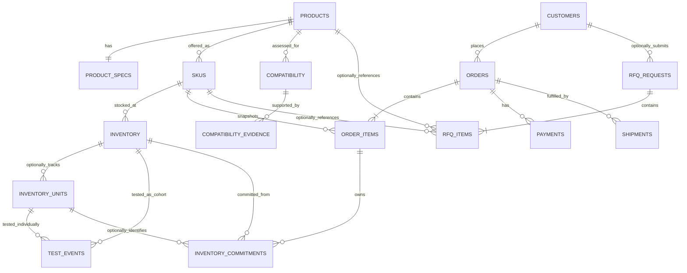

# LoonLink Data Model

## Status and design principles

This document defines the logical model. Phase 2A implements only `products`, `product_specs`, `skus`, `inventory`, `inventory_units`, and `test_events` in the initial version-controlled migration. Later entities remain design targets and are not present in the database yet.

### Phase 2A implementation decisions

- PostgreSQL enums constrain stable lifecycle/mode values; unresolved business rubrics such as condition grades remain constrained by future policy rather than invented values.
- SKU price and currency are nullable together. Checkout eligibility requires an active SKU with a non-negative integer minor-unit price and uppercase three-letter currency, but Phase 2A inserts no prices.
- Inventory tracking mode is immutable through direct table updates. A future authorized conversion transaction may convert an empty/uncommitted bucket; Phase 2A rejects direct conversion to eliminate aggregate/serialized overlap.
- An aggregate bucket owns `quantity_on_hand` and cannot own serialized-unit rows. A serialized bucket has null `quantity_on_hand`, and its physical count comes only from `inventory_units`. SQL checks and triggers enforce both sides.
- Inventory condition inherits the SKU's sellable condition basis. Only a serialized unit may record a factual `condition_grade_override`; a material public-grade difference requires moving the unit to an appropriate SKU before sale.
- Test `result` preserves the observed result (`passed`, `failed`, or `inconclusive`). Voiding is represented separately by immutable `voided_at`/`voided_by` metadata rather than overwriting the original result with a `voided` enum value.
- Test facts are append-oriented: target, method, result, tester reference, measurements, and notes cannot be rewritten. A correction creates a same-target superseding event; an existing event may be voided once.
- Every operational table has forced RLS with no access policies in Phase 2A. Public/customer access remains denied, and the storefront continues to use fixtures.
- `src/db/public-product.ts` is the typed allowlisted read boundary for future storefront queries. It contains no inventory quantity/location, serialized-unit, test-internal, cost/supplier, customer, payment, or admin fields.

The model follows these principles:

- model product identity separately from a sellable offer and from physical stock;
- store core searchable optical specifications in typed columns;
- retain immutable commercial and item snapshots on orders/RFQs;
- preserve source, scope, and review provenance for every compatibility conclusion;
- support aggregate used stock and optional one-by-one serialized tracking;
- give each physical unit exactly one authoritative inventory representation;
- derive customer-facing testing claims from applicable test events;
- represent money as integer minor units plus ISO currency;
- use UTC timestamps, explicit lifecycle values, foreign keys, check constraints, and unique indexes;
- expose only reviewed/published records through public read paths; and
- enforce stock changes atomically in Postgres.

## Four concepts that must not be conflated

| Concept | Meaning | Example (illustrative only) | Owns |
| --- | --- | --- | --- |
| **Product** | A normalized technical/catalog identity | An identified transceiver model | Manufacturer/part identity, title, description, publication state |
| **SKU** | A specific sellable offer for a product | A tested pre-owned offer with a particular grade/coding/packaging policy | Price, currency, condition grade, sellability, offer-specific attributes |
| **Inventory quantity** | Aggregate physical count for an interchangeable cohort | 12 on hand in one aggregate bucket | Physical quantity; commitments are represented separately |
| **Serialized inventory unit** | One individually tracked physical used item | One physical unit with internal asset ID and its own test record | Per-unit physical lifecycle, serial, cosmetic grade, and test facts |

A product is not stock. A SKU is not a physical unit. A quantity row is not a list of serial numbers. A serialized unit belongs to an inventory bucket and reaches its SKU through that parent relationship.

Each physical unit has exactly one stock authority:

- an **aggregate bucket** represents interchangeable units only through `quantity_on_hand` and must not have `inventory_units` rows; or
- a **serialized bucket** represents its physical stock only through `inventory_units` rows and must not carry an independently editable aggregate quantity.

Reservations and paid allocations are commercial commitments against that physical stock, not a second representation of the stock itself.

## Relationship overview

`inventory_units` is the physical table implementing optional serialized inventory units. `inventory_commitments` is the single reservation/allocation relationship for checkout. It never makes a second claim that a physical unit exists.

## Core entities

Common columns such as `id`, `created_at`, and `updated_at` are listed only where their behavior matters. UUIDs are the proposed identifier type.

### `products`

Normalized catalog identity independent of condition, quantity, and price.

| Column | Purpose |
| --- | --- |
| `id` | Primary key |
| `manufacturer_name` | Normalized manufacturer label; not an authenticity claim |
| `manufacturer_part_number` | Manufacturer-stated part number when supported by catalog evidence |
| `normalized_part_number` | Search/deduplication form |
| `title`, `slug` | Customer-facing identity and stable route |
| `description` | Reviewed factual description |
| `product_type` | Initially `optical_transceiver`; extensible later |
| `lifecycle_status` | Proposed: `draft`, `published`, `archived` |
| `published_at` | Publication control |
| `created_by`, `updated_by` | Operator attribution |
| `created_at`, `updated_at` | Audit timestamps |

Proposed uniqueness: normalized manufacturer plus normalized part number when a manufacturer part number exists; unique `slug`. A missing/uncertain part number must not be fabricated to satisfy uniqueness.

### `product_specs`

One typed specification row per product in the MVP. These are technical attributes, not proof of host compatibility.

| Column | Type concept | Search use |
| --- | --- | --- |
| `product_id` | FK/PK | Join |
| `form_factor` | constrained text/enum | e.g. SFP-family/QSFP-family categories |
| `data_rate_mbps` | positive integer | Range/exact filter |
| `ethernet_standard` | nullable constrained text | Exact/filter |
| `supported_protocols` | normalized array or later join table | Containment filter |
| `connector_type` | constrained text/enum | Exact filter |
| `fiber_mode` | enum such as single-mode/multimode/other/unknown | Exact filter |
| `fiber_count` | positive small integer | Exact filter |
| `max_reach_m` | non-negative integer | Range filter; scoped to recorded conditions |
| `center_wavelength_nm` | nullable numeric | Exact/range filter |
| `tx_wavelength_nm`, `rx_wavelength_nm` | nullable numeric | BiDi/directional lookup |
| `lane_count` | positive small integer | Exact filter |
| `bidirectional` | boolean | Exact filter |
| `duplex_mode` | enum | Exact filter |
| `digital_diagnostics` | enum: `yes`, `no`, `unknown` | Exact filter without false certainty |
| `temperature_min_c`, `temperature_max_c` | nullable numeric | Range/validation |
| `power_budget_db` | nullable numeric | Technical display/filter if evidence supports it |
| `spec_notes` | nullable reviewed text | Caveats not suited to columns |
| `extensions` | nullable JSONB | Non-core, namespaced attributes only |
| `source_summary`, `reviewed_at`, `reviewed_by` | provenance summary | Editorial accountability |

Unit suffixes are part of column names to prevent ambiguity. Unknown values stay null or explicitly unknown; absence is not converted to a favorable value. If product variants differ in a core optical specification, they should generally be separate products rather than SKU overrides.

Indexes should cover normalized part number, form factor, data rate, connector, fiber mode, reach, wavelength fields, and only the combinations supported by measured queries. Postgres full-text/trigram indexing can support search before an external search service is considered.

### `skus`

A SKU is a sellable offer of a product. Multiple SKUs may represent different condition grades, coding/labeling, packaging, or commercial treatment without changing the underlying technical identity.

| Column | Purpose |
| --- | --- |
| `id`, `product_id` | Identity and product FK |
| `sku_code` | Unique internal/public offer code |
| `condition_class` | Proposed: `pre_owned`, later possibly `new`; not inferred |
| `condition_grade` | Controlled rubric value; definition must be published before use |
| `coding_profile` | Nullable, evidence-backed offer-specific programming/coding description |
| `packaging_type` | Controlled optional value |
| `unit_price_minor` | Authoritative non-negative unit price in minor units |
| `currency` | ISO 4217 code; MVP sale currency expected to be CAD |
| `checkout_eligible` | Whether fixed-price self-service checkout is permitted |
| `lifecycle_status` | Proposed: `draft`, `active`, `inactive`, `archived` |
| `warranty_summary` | Nullable; only approved actual policy text/reference |
| `created_by`, `updated_by`, timestamps | Attribution |

Core optical properties should not be copied into a SKU merely for convenience. SKU-specific statements such as condition and coding require their own evidence/operational basis and must not overstate compatibility or authenticity.

### `inventory`

An inventory row is a homogeneous stock bucket/cohort for one SKU, location, tracking mode, sellable condition basis, and testing/provenance basis. A new receipt or materially different condition/testing basis should use a new bucket rather than silently mixing provenance. The initial implementation may use one logical location.

| Column | Purpose |
| --- | --- |
| `id`, `sku_id`, `location_code`, `cohort_code` | Unique stock bucket and traceability cohort |
| `tracking_mode` | `aggregate` or `serialized` |
| `quantity_on_hand` | Aggregate mode only: non-negative physical quantity; null for serialized mode |
| `reorder_or_hold_reason` | Optional internal operational note/status |
| `version` | Optional optimistic concurrency value |
| timestamps | Change timing |

Mode invariants:

- `aggregate`: `quantity_on_hand` is non-null and non-negative; no `inventory_units` may belong to the bucket;
- `serialized`: `quantity_on_hand` is null; physical quantity is the count of qualifying `inventory_units`;
- conversion between modes is an explicit transaction allowed only with no active commitments; and
- available-to-sell is always derived and is never a client input or separately editable field.

For aggregate mode, available-to-sell is `quantity_on_hand` minus active reserved/allocated `inventory_commitments`. For serialized mode, it is the count of on-hand units without an active commitment. Cross-table mode rules must be enforced by restricted transaction functions/triggers plus tests; direct customer writes are forbidden.

Condition inheritance:

- SKU condition is the sellable class/default and the public promise for the offer;
- a serialized unit may record a more specific or overriding condition;
- allocation and presentation must use the unit override when present; and
- if an override materially changes public grade, eligibility, or price, the unit must be moved to an appropriate SKU before sale rather than sold under a misleading SKU promise.

### `inventory_units` (optional serialized inventory units)

Used only when an individual physical unit needs traceability.

| Column | Purpose |
| --- | --- |
| `id`, `inventory_id` | Internal asset and authoritative parent stock reference; SKU is derived through the bucket |
| `internal_asset_tag` | Unique non-secret operational identifier |
| `serial_number` | Nullable sensitive identifier; visibility restricted and possibly encrypted/hashed per policy |
| `manufacturer_label_data` | Restricted structured/text facts captured from the unit; not proof of authenticity |
| `condition_grade_override` | Nullable per-unit override under the approved rubric |
| `cosmetic_notes` | Restricted/reviewed factual notes |
| `physical_state` | Proposed: `on_hand`, `shipped`, `quarantined`, `retired`; reservation/allocation is derived from commitments |
| timestamps | Traceability |

`inventory_units` does not duplicate `sku_id`, reservation owner, allocation owner, or inline test history. Those relationships are derived from its inventory parent, active commitment, and test events. A unique active commitment constraint prevents a serialized unit from being reserved or allocated twice.

### `test_events`

Minimal append-oriented testing history for an aggregate cohort or one serialized unit. Exactly one target must be set.

| Column | Purpose |
| --- | --- |
| `id` | Test event identity |
| `inventory_id` | Nullable aggregate/cohort target; valid only for an aggregate bucket |
| `inventory_unit_id` | Nullable serialized-unit target |
| `tested_at` | When the test occurred |
| `test_method_code`, `test_method_version` | Controlled method/reference without requiring a method-management subsystem |
| `result` | Observed result: `passed`, `failed`, or `inconclusive`; void state is separate so the original result is retained |
| `tester_reference` | Restricted operator/lab reference; not public by default |
| `quantity_tested` | Required positive quantity for cohort tests; one for unit tests |
| `notes` | Restricted factual notes |
| `measured_values` | Optional schema-versioned JSONB for non-core measurements |
| `public_summary` | Nullable approved summary for the safe public projection |
| `supporting_asset_path` | Optional restricted evidence asset |
| `supersedes_test_event_id`, `voided_at`, `voided_by` | Correction/history without destructive overwrite |
| timestamps | Traceability |

An aggregate test event applies only to the defined cohort and recorded quantity. Replenishment with a different testing basis creates a new cohort. A public “Tested” or “Tested Working” statement is derived only when applicable non-voided evidence satisfies the approved policy; it is never an arbitrary product/SKU boolean. A passed functional test does not establish authenticity, regulatory compliance, or host compatibility.

### `compatibility`

A reviewed conclusion connecting a product to a specifically scoped target. The MVP stores normalized target descriptors directly; if targets are reused at scale, a later `compatibility_targets` table may normalize them without changing semantics.

| Column | Purpose |
| --- | --- |
| `id`, `product_id`, `sku_id` | Conclusion identity, product, and optional SKU/coding scope |
| `target_scope_type` | `exact_model`, `device_family`, or `oem_part_number` |
| `target_vendor` | Normalized equipment vendor label |
| `target_platform` | Nullable family/platform |
| `target_model` | Nullable exact model |
| `target_part_number` | Nullable target/module identifier |
| `target_hardware_revision` | Nullable scope constraint |
| `software_name`, `software_version_constraint` | Nullable software scope |
| `firmware_name`, `firmware_version_constraint` | Nullable firmware scope |
| `coding_requirement` | Nullable required coding/profile |
| `conclusion` | `compatible`, `incompatible`, or `uncertain` |
| `verification_status` | `draft`, `in_review`, `verified`, `expired`, `withdrawn` |
| `scope_notes`, `caveats` | Required contextual limits as appropriate |
| `valid_from`, `review_due_at` | Review window |
| `reviewed_at`, `reviewed_by` | Human review attribution |
| `published_at`, `created_at`, `updated_at` | Lifecycle timestamps |

Public presentation rules:

- “verified compatible” requires `conclusion = compatible`, `verification_status = verified`, publication, an in-date review under policy, and qualifying active evidence;
- “verified unsupported/incompatible” requires the parallel reviewed negative record and must retain its exact scope;
- `uncertain`, `expired`, conflicting, withdrawn, or missing evidence can never render as verified;
- no matching row means unknown/no record, not incompatible;
- an exact applicable target record takes precedence over a broader family record; a family conclusion applies only to the scope explicitly supported by its evidence;
- SKU scope, when present, prevents a product-level result from being applied to another coding profile; and
- matching optical specifications alone do not create a compatibility row or verdict.

A uniqueness strategy should prevent overlapping duplicate conclusions for the same normalized target scope while still allowing versioned/review history. Prefer retaining superseded records over destructive replacement.

Scope constraints require the identifying field appropriate to `target_scope_type` (`target_model`, `target_platform`, or `target_part_number`). When `sku_id` is set, that SKU must belong to `product_id`. Matching code must not broaden null fields into an “all models/all versions” claim.

### `compatibility_evidence`

First-class provenance linked to a compatibility conclusion.

The conclusion is the reviewed decision; evidence is the preserved source material used to evaluate it. Adding, accepting, rejecting, contradicting, or superseding evidence does not silently overwrite the conclusion. Instead it makes the conclusion ineligible for verified public display until an authorized review confirms an applicable result.

| Column | Purpose |
| --- | --- |
| `id`, `compatibility_id` | Evidence identity and parent conclusion |
| `evidence_type` | Controlled type: vendor_document, vendor_matrix, lab_test, device_output, customer_report, correspondence, or other reviewed type |
| `title` | Human-readable source label |
| `source_publisher` | Who issued/provided the source |
| `source_url` | Nullable canonical URL |
| `source_document_identifier` | Part/document/revision number when available |
| `source_published_at`, `retrieved_at` | Source timing |
| `archived_asset_path` | Optional controlled stored copy where lawful and appropriate |
| `excerpt_or_summary` | Concise reviewed support; respect copyright/licensing |
| `supports_conclusion` | `supports`, `contradicts`, or `context_only` |
| `applicability_scope` | Exact model/revision/software/test conditions addressed |
| `test_environment` | Structured JSON or text for lab evidence; never replaces core target fields |
| `content_hash` | Optional integrity/deduplication aid |
| `review_status` | `pending`, `accepted`, `rejected`, `superseded` |
| `visibility` | `public_summary`, `internal`, or `restricted` |
| `reviewed_at`, `reviewed_by`, timestamps | Provenance and review |

Evidence is not deleted merely because a conclusion changes; it may support, contradict, be superseded, or be rejected with attribution. Conflicting applicable evidence forces an uncertain/unpublished result until an authorized review resolves it. A customer report remains unverified and cannot independently qualify a verified conclusion. A URL alone is insufficient provenance when the relevant scope cannot be determined. Acceptance for internal review does not make evidence public; only the visibility-approved citation/summary enters the public projection.

### `customers`

Represents the buyer/customer record used for orders and optionally linked to authentication.

| Column | Purpose |
| --- | --- |
| `id`, `auth_user_id` | Customer identity and optional Supabase Auth link |
| `email`, `phone` | Validated contact channels, minimized |
| `contact_name` | Business contact |
| `business_name` | Customer-supplied organization name; not verified unless explicitly marked through a future process |
| `tax_identifier` | Not collected by default; future need and protection require review |
| `marketing_consent_at` | Separate explicit consent if marketing is ever introduced |
| timestamps | Record lifecycle |

Guest checkout may create a customer/order contact snapshot without requiring an account; this is an unresolved product decision. Customer data is private and subject to retention/access rules.

### `orders`

Commercial record with immutable-at-purchase snapshots.

| Column | Purpose |
| --- | --- |
| `id`, `order_number` | Internal key and unique public-safe reference |
| `customer_id` | Nullable for supported guest flow |
| `contact_snapshot` | Minimal structured checkout contact snapshot |
| `billing_address_snapshot`, `shipping_address_snapshot` | Required fulfillment/accounting snapshots; protected PII |
| `currency` | Single ISO currency for the order |
| `subtotal_minor`, `discount_minor`, `shipping_minor`, `tax_minor`, `total_minor` | Server-computed non-negative totals |
| `order_status` | Proposed order lifecycle: `draft`, `checkout_pending`, `confirmed`, `processing`, `completed`, `cancelled`, `requires_review`; separate from payment and shipment status |
| `exception_reason` | Nullable controlled reason such as `paid_unallocatable`; never a public free-form diagnostic |
| `reservation_expires_at` | Abandoned-checkout control |
| `stripe_checkout_session_id` | Nullable unique external reference |
| `placed_at`, `cancelled_at`, timestamps | Lifecycle |

Totals must satisfy documented arithmetic constraints. Tax is not assumed zero in production; the production tax solution remains unresolved.

### `order_items`

| Column | Purpose |
| --- | --- |
| `id`, `order_id`, `sku_id` | Line identity and source SKU reference |
| `product_id` | Direct reference useful for history/reporting |
| `sku_code_snapshot`, `product_title_snapshot`, `part_number_snapshot` | Immutable display identity at purchase |
| `condition_snapshot`, `spec_summary_snapshot` | Reviewed purchase-time representation |
| `quantity` | Positive integer |
| `unit_price_minor`, `line_discount_minor`, `line_total_minor`, `currency` | Server-computed monetary snapshot |
| `compatibility_reference_id` | Nullable; records a viewed/selected conclusion without turning it into a guarantee |

Serialized allocations link inventory units to an order item only through `inventory_commitments`. An order snapshot remains readable if the catalog later changes.

### `payments`

| Column | Purpose |
| --- | --- |
| `id`, `order_id` | Payment attempt and order |
| `provider` | Initially `stripe` |
| `provider_checkout_session_id`, `provider_payment_intent_id` | Nullable unique provider references |
| `status` | Proposed: `created`, `pending`, `succeeded`, `failed`, `cancelled`, `partially_refunded`, `refunded` |
| `amount_minor`, `currency` | Expected/confirmed amount |
| `failure_code` | Sanitized operational code, no sensitive payment data |
| `paid_at`, `refunded_at`, timestamps | Lifecycle |

Do not store PAN, CVC, full payment method details, or raw webhook payloads indefinitely. Store only provider references and minimal non-sensitive operational data.

### `shipments`

| Column | Purpose |
| --- | --- |
| `id`, `order_id` | Shipment and order |
| `status` | Proposed: `pending`, `packed`, `shipped`, `delivered`, `exception`, `returned` |
| `carrier`, `service_level` | Controlled/free text initially, operator-entered |
| `tracking_number` | Sensitive customer/order data; restrict access and logs |
| `shipped_at`, `delivered_at`, timestamps | Lifecycle |

Multiple shipments per order are supported without requiring split-shipment UI in the first release.

### `rfq_requests`

| Column | Purpose |
| --- | --- |
| `id`, `public_reference` | Internal and non-enumerable public reference |
| `customer_id` | Nullable authenticated customer link |
| `contact_name`, `business_name`, `email`, `phone` | Private requester details |
| `country`, `province` | Validated location context where needed |
| `equipment_context`, `message` | Length-limited, untrusted text |
| `status` | Proposed: `new`, `reviewing`, `awaiting_customer`, `closed_won`, `closed_lost`, `spam` |
| `assigned_to`, `submitted_at`, timestamps | Operations |

An RFQ is not an order, price commitment, compatibility verdict, or inventory reservation.

### `rfq_items`

| Column | Purpose |
| --- | --- |
| `id`, `rfq_request_id` | Line identity |
| `product_id`, `sku_id` | Nullable catalog references |
| `requested_part_number`, `description` | Snapshot/free-text need when catalog item is absent |
| `quantity` | Positive integer |
| `target_equipment` | Optional length-limited structured JSON/text for review |
| `condition_preference` | Optional controlled preference |

Each item must identify at least a product, SKU, part number, or meaningful description.

## Supporting operational tables

These tables are needed to satisfy the architecture even though they are not top-level merchandising entities:

- **`inventory_commitments`**: the single order-linked reservation/allocation relationship. It contains order item, inventory bucket, optional inventory unit, quantity, state (`reserved`, `allocated`, `released`, `consumed`), idempotency key, and expiry. Aggregate commitments have no unit and a positive quantity; serialized commitments identify one unit and quantity one. Unique active-unit and operation constraints prevent double commitment and duplicate mutation. Inventory units do not duplicate order linkage.
- **`stripe_webhook_events`**: unique Stripe event ID, type, processing status, timestamps, attempt/error summary, and optional minimal payload reference. The unique event ID is the first idempotency barrier.
- **`admin_memberships` or roles/claims mapping**: auth user, approved role, active state, grant/revoke attribution. Do not accept user-editable metadata as admin authority.
- **`audit_events`**: actor, action, entity type/ID, timestamp, and safe change metadata for sensitive operator actions.

These additions should remain small and purpose-built. Email delivery, analytics warehouses, and general event sourcing are not required for the MVP.

## Transaction and lifecycle invariants

### Inventory reservation

Within one database transaction:

1. lock the applicable aggregate bucket or candidate serialized unit rows;
2. recheck SKU eligibility and available quantity;
3. create order items and an active expiring `inventory_commitment` using server-authoritative values;
4. for a serialized unit, rely on the unique active commitment to make it unavailable; do not create a second reservation owner on the unit;
5. commit once, or change nothing.

Reservation allocation, release, and consumption are idempotent. A unique operation/idempotency key prevents duplicate mutations. Expiry processing locks and rechecks the current order/payment state before releasing a commitment. Aggregate availability is derived from active commitments; serialized availability is derived from on-hand units lacking one.

### Successful payment

Within one database transaction after verified webhook parsing:

1. deduplicate the Stripe event;
2. lock payment, order, and reservation records;
3. verify provider references, amount, and currency against server records;
4. transition the payment and order only if the current state permits it;
5. convert active reservations to allocated commitments exactly once; do not reduce physical on-hand quantity until shipment/physical disposition;
6. record the event as processed and commit.

If the reservation has expired, the transaction may attempt a new commitment only if stock is still available. If allocation is impossible, payment remains truthfully recorded as succeeded while the order moves to `requires_review` with `paid_unallocatable`; no replacement stock is invented. An operator must resolve fulfillment or refund.

At shipment/physical disposition, one transaction decrements an aggregate bucket's `quantity_on_hand` and consumes its allocated commitment, or moves a serialized unit from `on_hand` to `shipped` and consumes its commitment. Availability therefore stays reduced from reservation through shipment without a second allocation counter.

Cancellation releases an unconsumed commitment. Refund does not itself restock inventory. Cancellation before shipment returns still-on-hand stock to availability by releasing its commitment without incrementing physical quantity. Stock already shipped is added back only through a separate authorized receipt/restock action after return and any required inspection/testing.

## Public/private classification and read models

| Classification | Examples | Access rule |
| --- | --- | --- |
| **Public** | Published product identity/specifications; active public SKU code, approved condition, price/currency; safe availability label; reviewed compatibility conclusion/scope/caveats; visibility-approved evidence citation/summary; approved test summary | Only through an explicit allowlisted public projection |
| **Authenticated customer** | Own profile fields; own sanitized orders/items/payment status; own shipment tracking; own RFQs if supported; possibly allocated-unit serial in a future approved policy | Ownership checked from trusted relations; never another customer's data |
| **Admin** | Draft catalog; price management; exact stock where needed; compatibility review; complete test records; RFQ/order operations; audit views | Server-authorized least privilege |
| **Sensitive operational** | Serial numbers before any approved purchaser disclosure; cost price; supplier identity/terms; private inventory notes/location; raw evidence assets; customer PII; Stripe identifiers/webhook data; tester identity; raw measurements; secrets/security logs | Never in public catalog responses; restricted need-to-know access and logging |

Cost price and supplier information are not MVP catalog fields. If later added, they are sensitive operational data by default.

### Allowlisted public catalog DTO

The public catalog/read DTO may contain only:

- published product `slug`, approved manufacturer/part identity, title, description, and approved media;
- allowlisted structured optical specification fields and reviewed public notes;
- active SKU code, public condition/packaging/coding descriptions, authoritative public price/currency, checkout eligibility, and approved warranty summary;
- a derived availability label or an explicitly approved public quantity—never location, commitments, unit rows, or private notes;
- a derived approved test claim/summary based on applicable test events—never tester identity, raw measurements, private notes, or restricted assets; and
- published compatibility conclusion, exact scope, caveats, review timing, and only evidence fields classified `public_summary`.

Serial numbers, cost/supplier data, raw inventory counts unless deliberately approved, customer/order/RFQ data, Stripe identifiers, internal evidence, test internals, and admin metadata are prohibited. Product pages, compatibility pages, public APIs, SEO metadata, JSON-LD, sitemaps, feeds, previews, and other indexable output must use this DTO or an equally strict allowlisted projection. Hiding a field in the UI is not a security boundary.

Evidence and audit history are retained/superseded according to an approved policy rather than silently overwritten. PII, serial numbers, webhook payloads, and operational logs are minimized and governed by documented retention before production.

Detailed RLS and authorization requirements are in `SECURITY.md`.

## Decisions deferred to migration design

- exact Postgres enum versus lookup/check-constraint strategy;
- normalized protocol and compatibility-target tables versus constrained arrays/fields at launch;
- inventory locations and serialized-unit selection policy;
- whether public availability uses threshold labels or deliberately approved exact aggregate quantity;
- guest checkout/account linkage;
- retention/encryption policy for serial numbers and stored evidence;
- tax, shipping, refund, warranty, and return fields required by approved operations; and
- whether historical versions use temporal tables, explicit supersession links, or append-only revisions.
