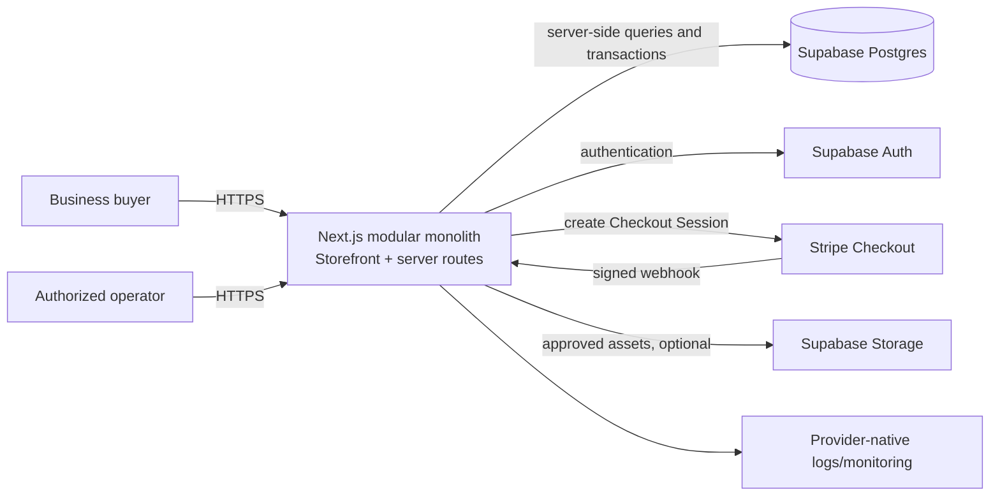

# LoonLink

> **Status:** LoonLink is under development. Phase 1C provides a frontend-only storefront experience backed exclusively by synthetic public fixtures; no production service or persistent commerce data has been implemented.

LoonLink is a planned B2B optical transceiver commerce and compatibility platform, initially focused on the Canadian market. It is intended to help businesses discover, evaluate, and purchase tested pre-owned enterprise optical transceivers using structured technical specifications, transparent inventory condition, and evidence-backed compatibility information.

LoonLink is a working product and brand name. This repository makes no claim that the name is trademarked, registered, incorporated, or legally cleared.

## The business problem

Buying optical transceivers is often harder than matching a connector and data rate. Buyers may need to reconcile host platform, manufacturer part number, form factor, fibre type, reach, wavelength, software constraints, coding, condition, and available quantity. Marketplace listings frequently omit this context or make compatibility claims without enough evidence to evaluate them.

LoonLink is designed to make those decisions more legible. It will separate product identity, sellable SKUs, aggregate stock, and individually tracked used units; expose normalized specifications for search; identify the evidence behind compatibility records; and distinguish verified, unsupported, and uncertain conclusions. It will not invent or infer product compatibility, certification, authenticity, or compliance.

Each physical unit will have one inventory authority: an interchangeable aggregate cohort or an individually serialized record, never both. Customer-facing testing statements will derive from applicable test events rather than a generic product flag.

## Compatibility-first approach

Compatibility is a first-class domain rather than a marketing label:

1. A buyer searches by product attributes, part number, or target equipment.
2. LoonLink returns structured product and inventory information.
3. Any compatibility result carries a status, scope, provenance, and supporting evidence.
4. Conflicting or insufficient evidence is shown as uncertain, never as verified.
5. Buyers can request a quote or clarification when available evidence is insufficient.

Compatibility information is decision support, not a guarantee. Wording and evidence display must accurately reflect the underlying record.

## Planned technology stack

| Area | Planned choice |
| --- | --- |
| Application | Next.js App Router, React, TypeScript |
| Styling | Tailwind CSS and shadcn/ui; accessible, semantic UI primitives |
| Hosting | Vercel; Pro is the early-production target |
| Data | Supabase Postgres, initially Supabase Free where appropriate |
| Authentication | Supabase Auth |
| File storage | Supabase Storage for approved product/evidence assets if needed |
| Payments | Stripe Checkout, created server-side; no card data stored by LoonLink |
| Validation | Zod at untrusted boundaries |
| Testing | Vitest, React Testing Library, Playwright, and database/integration tests |
| Observability | Structured application logs and provider-native monitoring initially |

These are architectural choices, not evidence that the services are configured. The fixed development infrastructure target is CAD $0/month. Supabase should be upgraded only when usage or reliability requirements justify it.

## High-level architecture



The browser is untrusted. Pricing, discounts, authorization, inventory availability, compatibility publication state, and order transitions are enforced on the server and in the database where appropriate. Public APIs and indexable pages use allowlisted projections that exclude serial numbers, customer information, supplier/cost data, sensitive payment identifiers, and internal inventory, evidence, or testing details.

## Phase 0 documents

- [PRD.md](./PRD.md) — product requirements and MVP boundary
- [AGENTS.md](./AGENTS.md) — mandatory implementation rules
- [ARCHITECTURE.md](./ARCHITECTURE.md) — system design and flows
- [DATA_MODEL.md](./DATA_MODEL.md) — proposed domain model; no migrations yet
- [SECURITY.md](./SECURITY.md) — threat model and controls
- [ROADMAP.md](./ROADMAP.md) — phased delivery plan

## Local development

Requirements:

- Node.js 22.17 or newer within the Node 22 release line
- npm 10 or newer

Install dependencies and start the local development server:

```bash
npm ci
npm run dev
```

Open `http://localhost:3000`. The non-indexed `/design-system` route is a development reference containing clearly labelled illustrative UI fixtures. Phase 1C does not require environment variables, so there is no `.env.example` file.

Phase 1C includes the storefront homepage, fixture product discovery, fixture product detail pages, and inactive compatibility and sourcing previews. These routes demonstrate the intended customer experience; they do not establish actual stock, price, testing, compatibility, availability, or an offer to sell.

### Fixture boundary

Development catalog data is centralized in `src/features/catalog/public-fixtures.ts`. Its type is an explicit customer-safe projection containing only product identity, display condition/testing/pricing states, essential specifications, additional public fixture detail, and presentation notes. It deliberately contains no serial number, exact quantity, cost, supplier, customer, Stripe, private-note, tester-identity, or measured-value fields.

The fixture module is the replacement seam for Phase 2 persistence. Public pages must continue to consume an allowlisted projection when database-backed catalog records arrive; swapping the data source must not broaden the exposed field set.

## Quality commands

| Command | Purpose |
| --- | --- |
| `npm run lint` | Run ESLint |
| `npm run typecheck` | Run strict TypeScript checking without emitting files |
| `npm test` | Run Vitest component/unit tests once |
| `npm run test:watch` | Run Vitest in watch mode |
| `npm run test:e2e` | Run the Playwright Chromium smoke test |
| `npm run build` | Create a production Next.js build |
| `npm run start` | Serve an existing production build |

The local Playwright configuration uses an installed Google Chrome browser. Linux CI installs Playwright-managed Chromium before running the end-to-end test:

```bash
npx playwright install --with-deps chromium
```

GitHub Actions runs linting, type checking, unit tests, the production build, and Playwright in separate foundation jobs.

The production build uses Next.js's supported webpack fallback because the current macOS 13 ARM development host blocks an internal Turbopack CSS-worker port. Development still uses the default Turbopack server, and CI runs the same production build script documented above.

## Phase 1 foundation structure

```text
src/
  app/                 App Router entry points and global styles
  components/
    catalog/           Public fixture storefront presentation
    layout/            Accessible responsive application shell
    ui/                Reusable design-system primitives
  features/
    catalog/           Centralized allowlisted public fixtures and filtering
  lib/                 Shared framework utilities
tests/
  e2e/                 Playwright smoke tests
```

## Current limitations

There is no deployed product, purchasable inventory, configured payment flow, compatibility dataset, or supported-product commitment yet. Supabase, Stripe, authentication, catalog persistence, real inventory, cart, checkout, payments, RFQ submission, and administration are not configured in Phase 1C. Tax integration remains a future production requirement.
